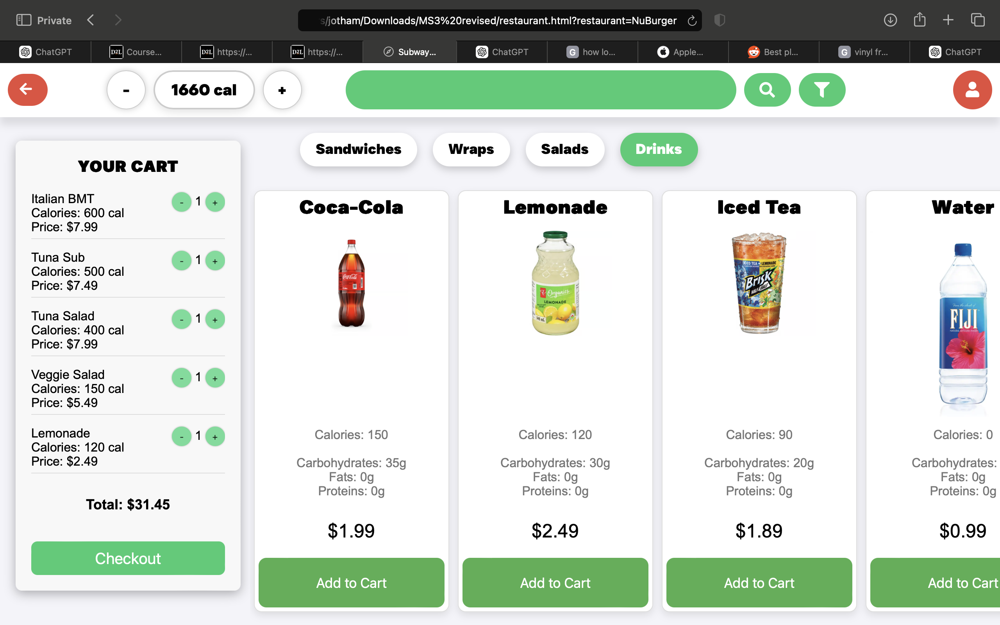

# Calories-Based Food Delivery App Prototype

## Overview
This is a prototype for a calories-based food delivery application. The app helps users select meals based on their calorie preferences and dietary requirements.

## Features
- Browse meals based on calorie count
- Filter by dietary preferences
- Add meals to cart and calculate total calorie intake
- Responsive UI for a seamless experience on all devices

## Run Instructions

Open the `index.html` file in a browser.

## Technologies Used
- HTML, CSS, JavaScript
- Optional: Bootstrap/Tailwind for styling

## Contributing
Feel free to fork this repository and submit pull requests with improvements!

## License
This project is licensed under the MIT License.
